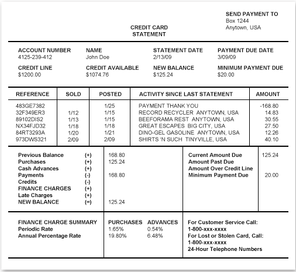
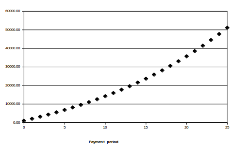

###  Linear growth problems from previous slides 

-   electricity bills $$b(k) = p \times k + base$$ where $k$ is the
    number of kWh used, $p$ is the price per one kWh and $base$ is the
    base payment when the client does not use any electricity

-   car rental companies

    -   Watertown $$w(m) = 79.00$$

    -   U-Hal $$u(m) = 1.39 \times m + 29.95$$

    -   Budget $$u(m) = 0.99 \times m + 29.95$$

    -   Enterprise\
        $e(m) = 59.95$ for $m <= 100$, and\
        $e(m) = 0.59\times m + 59.95$ for $m >100$

 Simple vs. Compound Interest or Linear vs. Exponential Growth 
===============================================================

###  Which bank would you use? 

-   You have \$1,000.00 to invest.

-   **SaveWithUs** offers you a savings account that pays \$100.00 flat
    bonus at the end of every year for which you keep the money in their
    account.

-   **BetterSavings** offers you a savings account that pays 8% interest
    at the end of each year for which you keep the money in their
    account. (It is 8% of the account balance, so the actual amount
    varies from year to year.)

-   Which option would you select?

###  Which bank would you use? 

   **year**   **SaveWithUs (\$100.00)**   **BetterSavings (8%)**
  ---------- --------------------------- ------------------------
      0              \$1,000.00                 \$1,000.00
      1              \$1,100.00                 \$1,080.00
      2              \$1,200.00                 \$1,166.40
      3              \$1,300.00                 \$1,259.71
      4              \$1,400.00                 \$1,360.49
      5              \$1,500.00                 \$1,469.33
      6              \$1,600.00                 \$1,586.87
      7              \$1,700.00                 \$1,713.82
      8              \$1,800.00                 \$1,850.93
      9              \$1,900.00                 \$1,999.00
      10             \$2,000.00                 \$2,158.92

###  Which bank would you use? 

-   What are the functions that represent both investments?

-   SaveWithUs: $$b(y) = 1000.00 + 100y$$ it is a linear function

-   BetterSavings: $$b(y) = 1000.00 \times (1+0.08)^y$$ it is an
    **exponential function**

-   The first model is called **simple interest** - the bank is paying a
    10% interest, but it is always 10% of the original investment (so it
    is really a fixed amount).

-   The second model is called **compound interest** - the bank is
    paying a 8% interest of whatever the balance of the account is (so
    it is changing over time).

###  Which bank would you use? 

{width="90.00000%"}

Graph generated and viewable at
<https://www.desmos.com/calculator/ablq5wdunm>

###  Which bank would you use? 

How big would the difference be after 20 years?

Significance of Doubling
========================

###  Rice and the Chessboard Story 

-   The creator of the game of chess showed his invention to the ruler,
    the ruler was highly impressed.

-   He was so impressed, in fact, that he told the inventor to name a
    prize of his choice.

-   The inventor, being rather clever, said he would take a grain of
    rice on the first square of the chessboard, two grains of rice on
    the second square of the chessboard, four on the third square, eight
    on the fourth square, and so on, doubling the number of grains of
    rice for each successive square.

-   The ruler laughed at such a modest prize, but he ordered his
    treasurer to count out the rice.

###  Rice and the Chessboard Story 

-   What do you think about the prize that the creator of chess asked
    for?

-   Can you guess how many grains of rice will he receive?

###  Rice and the Chessboard Story 

-   ...

-   The treasurer took more than a week to count the rice in the ruler’s
    store, only to notify the ruler that it would take more rice than
    was available in the entire kingdom.

-   (Shortly thereafter, as the story goes, the inventor became the new
    king.)

###  Rice and the Chessboard Story 

How many grains?

-   square 1: 1 grain

-   square 2: 2 grains

-   square 3: 4 grains

-   square 4: 8 grains

-   square 5: 16 grains

-   square 6: 32 grains

-   square 7: 64 grains

Can you see the pattern? What would the number of grains be for a square
$s$?

###  Rice and the Chessboard Story 

How big is $2^{s-1}$ ?

-   square 5: so $s=5$ and $2^{5-1} = 16$ grains

-   ...

-   square 10: so $s=10$ and $2^{10-1} = 512$ grains

-   ...

-   square 16: so $s=16$ and $2^{16-1} = 32,768 $ grains

-   ...

-   square 32: so $s=16$ and $2^{32-1} = 2,147,483,648 $ grains

-   ...

-   square 64: so $s=16$ and $2^{32-1} = 9,223,372,036,854,775,808 $
    grains

Population Growth
=================

###  

{width="100.00000%"}

###  World vs. U.S. Population 

Work with a partner to try to answer the following questions:

###  A sweet old lady ... 

-   *I met a sweet old lady yesterday when I was waiting for the train.
    We started talking and she told me about her four adult children and
    their wonderful life and how very proud she was of her seventeen
    grandchildren ...*

-   *All I was thinking: “Oh my gosh! This is exponential growth!”*

-   Is it really exponential growth? Why?

-   Assuming the same type of growth for the next generation, how many
    great-grandchildren will the *sweet old lady* have?

-   Assuming the same type of growth for the following generation, how
    many great-great-grandchildren will she have?

### Human generation 

-   How many years is one human generation?

    -   This will vary from one culture to another, from one part of the
        country to another and from one family to another.

    -   Right now, most estimates claim that it is 25 years

    -   See
        <http://isogg.org/wiki/How_long_is_a_generation%3F_Science_provides_an_answer>
        for more scientific discussion

-   The first Dutch settled (made land claims) in the New York area
    in 1609. How many generations is it since then?

    -   Assuming 25 years per generation, there are 4 generations in
        each century (100 years).

    -   In 400 years, we have 16 generations.

-   The ancient Egypt dates back to 3100 B.C. How many generations is it
    since then?

    -   It is the same 4 generations per century.

    -   Now we have 50 centuries, so it is approximately 200
        generations.

###  Human generations and population growth 

{width="30.00000%"}

-   Assume that each generation in a family line produces 2 offsprings.

-   Consider your ancestor from 4 generations ago (your
    great-grandmother), how many “relatives” do you have from that
    branch of a family tree?

    -   1 - great-grandmother

    -   2 - grandparent

    -   4 - parent

    -   16 - you

###  Human generations and population growth 

-   What if each generation produced 3 offsprings, how many “relatives”
    do you have from that branch of a family tree in four generations?

-   -   What if each generation produced 6 offsprings, how many
    “relatives” do you have from that branch of a family tree in four
    generations?

-   -   What is the function that we can use to calculate this?

    -   $r(g) = n^g$

    -   $g$ is the number of generations, $n$ is the number of
        offsprings per generation, $r(g)$ is the function of number of
        generation that calculates the number of “relatives”

###  Other Factors of Human Population 

Birth rates (i.e., the number of offsprings per generation) are not the
only factors that influence the current size of human population.

What are some other factors?

Borrowing and Saving
====================

###  Credit Cards 

-   John Doe charged \$125.24 to his credit card during the last
    statement period.

-   His minimum payment due is \$20.00.

-   He decides to settle his debt with the credit card company by making
    the \$20.00 monthly payments.\
    He also is not going to be using this credit card anymore.

-   The credit card company charges 1.65% montly interest rate on the
    unpaid amount.

-   How many months will it take him to be debt free?\
    How much extra is he going to pay the bank?

{height="0.8\textheight"}

###  Credit Cards 

###  Credit Cards 

-   Think about:

    -   How is the value of interest paid affected by the interest rate?

    -   How is the value of interest paid affected by the initial
        balance?

    -   How is the value of interest paid affected by the amount of
        monthly payments?

    -   What is the function that calculates the total amount that will
        be paid with the fixed monthly payments and fixed interest rate?

    -   What is the function that calculated the payment balance after
        each month with the fixed monthly payments and fixed interest
        rate?

###  Saving For Retirement 

Simplified model:

-   At the end of each year (till your retirement) you deposit \$1000.00
    in your retirement account.

-   The brokerage managing your money, guarantees that they can make 5%
    interest on the balance of the account each year.

-   How much money will there be in the account in 1 year, 2 year, 10
    year, 20 years?

    -   year 0: deposit \$1000.00, no interest yet

    -   year 1: balance plus interest \$1000.00 ( 1 + 0.05) = \$1050.00\
        new deposit: \$1000.00, total: \$2050.00

    -   year 2: balance plus interest \$2050.00 ( 1 + 0.05) = \$2152.50\
        new deposit: \$1000.00, total: \$3152.50

    -   ...

{height="0.8\textheight"}

Exercises
=========

###  Try it Yourself 

###  Try it Yourself 

-   A rare coin appreciates at a rate of 5.2% a year. If the initial
    value of the coin is \$500, after how many years will its value
    cross the \$3,000 mark? Show the formula that models the value of
    the coin after t years.

-   A local college has increased its number of graduates by a factor of
    1.045 over the previous year for every year since 1999. In 1999, 924
    students graduated. What explicit formula models this situation?
    Approximately how many students will graduate in 2014?

-   A three-bedroom house in Burbville sold for \$190,000. If housing
    prices are expected to increase 1.8% annually in that town, write an
    explicit formula that models the price of the house in t years. Find
    the price of the house in 5 years.

###  Try It Yourself 

Retirement savings

-   What is the function that would calculate the value of your
    retirement assuming a fixed interest rate and fixed yearly deposit?

-   How does this formula compare to the credit card payment formula?

-   How would the value of your retirement account change if the
    payments were made monthly and interest compounded monthly?

-   How much would be in your retirement account if you were earning
    interest equal to the interest rate charged by the banks on your
    credit card balance?

